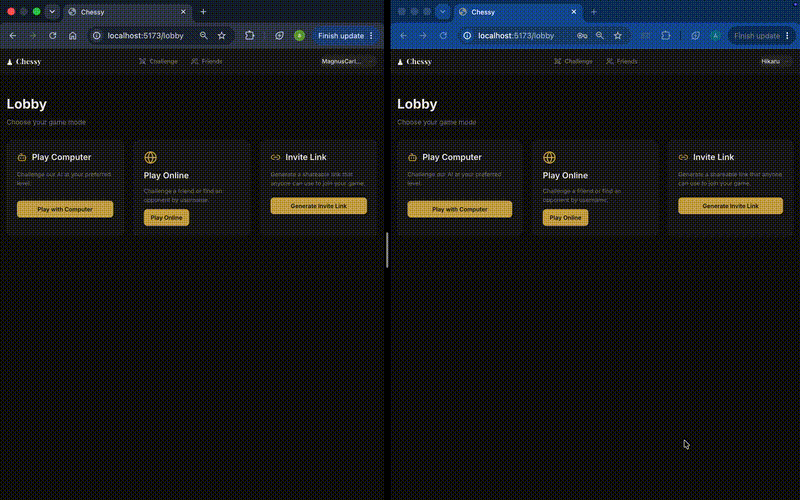

# Chessy


## Table of Contents

- [Overview](#overview)
- [Features](#features)
- [Engineering Highlights](#engineering-highlights)
- [Architecture](#architecture)
- [Technology Stack](#technology-stack)
- [Technical Challenges & Engineering Decisions](#technical-challenges-and-engineering-decisions)
- [Running the Project](#running-the-project)
- [Future Improvements](#future-improvements)

## Overview

Chessy is a full-stack web chess platform for real-time online matches, computer opponents, social features, and persistent game history. It provides a complete chess experience — matchmaking, live gameplay, player profiles, and game records — through a responsive web interface.




Built with Spring Boot, React, TypeScript, PostgreSQL, and Socket.IO, Chessy follows a **server-authoritative architecture**: the backend owns game state, validation, and business rules, while the frontend focuses on interaction and presentation. REST APIs handle reliable state retrieval, and Socket.IO delivers real-time updates for gameplay, challenges, and social interactions.

The project's core engineering focus is building a reliable real-time application: secure JWT-based authentication shared across HTTP and WebSocket channels, concurrency-safe server-side game processing, synchronized client-server clocks, and event-driven backend design — all while keeping concerns cleanly separated and components reusable.


## Features

**Authentication**

- Email/password or Google sign-in, with persistent sessions and protected routes

**Challenges & Matchmaking**

- Search for players and send challenges with configurable time control, increment, and color preference
- Accept, decline, or cancel challenges in real time, with automatic expiration
- Seamless transition from an accepted challenge into a live game

**Online Multiplayer**

- Real-time matches with full rule enforcement (checkmate, stalemate, threefold repetition, insufficient material, fifty-move rule)
- Resign, offer/respond to draws, and automatic reconnect recovery
- Move history navigation, live clocks, and state that survives page reloads or dropped connections

**Computer Opponents**

- Configurable difficulty, color, and time control against a built-in bot
- Human-like move pacing, with resign/abort support and correct resume after interruption

**Live Game Clocks**

- Smooth, accurate per-player countdowns with low-time visual and accessible cues, unaffected by device or network variability

**Friends**

- Send, accept, decline, or cancel friend requests; remove existing friends
- Live-updating friends list and pending requests, no refresh required

**Profiles & Game History**

- Public profiles by username, user search, incrementally-loaded game history, and basic win/loss/draw stats

**Real-Time Notifications**

- Toast alerts for incoming challenges and friend requests from anywhere in the app, actionable directly from the notification, with no risk of a missed request being lost

## Engineering Highlights

At a glance, the system-wide engineering decisions that shape Chessy (detailed further below):

- **Server-authoritative by default** — moves, bot play, and timeouts are all validated and computed server-side; the client only submits intent and renders confirmed state.
- **Domain-matched concurrency control** — hand-rolled, operation-specific optimistic locking replaces Hibernate's entity-wide default.
- **Unified REST-snapshot + Socket.IO-delta sync** — applied consistently across games, challenges, and friendships, with explicit reconnection recovery.
- **Single JWT identity model** spanning both REST and WebSocket authentication.
- **Event-driven backend** decoupling business logic from broadcasting, bot computation, and scheduling.
- **Startup recovery scans** ensuring correctness survives crashes and scheduler timing gaps.
- **Query-driven database design** — denormalization and indexing built from actual access patterns.
- **NTP-style clock synchronization** for accurate countdowns under real-world network conditions.

## Architecture

```
                React + Zustand
              (Client Application)
             ╱                  ╲
     REST API                  Socket.IO
 (Snapshots & Commands)    (Live Updates)
             ╲                  ╱
          Spring Boot Backend
        (Authentication + Domain Logic)
                  │
                  ▼
             PostgreSQL
         (Source of Truth)
                  │
                  ▼
        Domain Events → Clients
```

The principle applied consistently across every feature — gameplay, clocks, challenges, friendships — is that **the backend owns state and truth; the frontend renders and forwards intent.** REST and Socket.IO are complementary: REST handles reliable reads (initial load, reconnect snapshots, history), while sockets deliver low-latency updates after a change has already been validated and persisted. A single JWT authenticates both channels.

**Backend** follows a consistent Controller → Service → Repository → PostgreSQL structure, with all business logic in domain services. Notable patterns:

- **Event-driven decoupling** — broadcasting, async bot-move computation, and notifications are triggered via post-commit domain events.
- **Strategy pattern for extensibility** — the bot opponent sits behind an interface selected by a factory, so new engines require no orchestration or persistence changes.
- **Persisted-state re-validation** — scheduled tasks (timeouts, bot-move completion) are advisory only; the backend re-checks persisted state before acting, with startup recovery scans covering crash scenarios.

**Frontend** follows a repeating layering pattern: presentational components → orchestration hooks → Zustand stores → a thin service/transport layer.

- **Feature-based organization** across auth, games, challenges, friendships, and profiles.
- **Zustand for shared, live-updating state** — used where multiple components need the same data and it has to stay in sync with real-time updates, like game state or notifications.
- **Centralized socket ownership** — one mounted-once hook per domain owns socket listeners and translates events into store updates.
- **Layered API access** — Axios middleware handles token attachment, refresh, and retry; service modules isolate HTTP calls from hooks and components.
- **Reusable presentation** — shared board/controls/result components serve both online and computer games.

**Real-time layer** authenticates Socket.IO with the same JWT as REST, using the server-resolved user ID (never a client-supplied one) for authorization and room membership.

- **Rooms as the addressing primitive** — updates go to user-specific rooms.
- **Snapshot + delta sync** — REST establishes a full state snapshot before Socket.IO delivers incremental updates; reconnection re-establishes the snapshot before resuming live events.

**Database** design (PostgreSQL, Flyway-managed, JPA/Hibernate) intentionally overrides several Hibernate defaults:

- **Read-optimized denormalization** — current position (FEN) stored alongside full move history (JSONB) to avoid board reconstruction on read.
- **Mode-specific tables** — online and computer games use separate tables rather than one polymorphic table.
- **Canonical ordering for symmetric relationships** — friendships store one row per pair using deterministic UUID ordering plus a `requester` field for directionality.
- **Operation-specific concurrency control** — independent version counters replace a single entity-wide optimistic lock.

## Technology Stack

|Category|Technology|Purpose|
|---|---|---|
|Backend|Spring Boot 3.5 (Java 21)|Core REST API and application server|
|Backend|Spring Security|Authentication and authorization|
|Backend|Spring OAuth2 Client|Google OAuth login integration|
|Backend|Netty-SocketIO|Real-time WebSocket communication|
|Backend|JJWT|JWT issuance and validation|
|Backend|chesslib|Chess move legality and rules engine|
|Database|PostgreSQL|Primary relational data store|
|Database|Spring Data JPA / Hibernate|ORM and persistence layer|
|Database|Flyway|Versioned schema migrations|
|Frontend|React 18 + TypeScript|UI framework|
|Frontend|Vite|Frontend build tool and dev server|
|Frontend|Zustand|Global client-side state management|
|Frontend|React Router|Client-side routing|
|Frontend|Axios|HTTP client with token refresh middleware|
|Frontend|react-chessboard / chess.js|Chessboard rendering and move handling|
|Real-Time Communication|Socket.IO (client & server)|Live game, challenge, and notification updates|
|Authentication|JWT + Google OAuth2|Stateless auth with rotating refresh tokens|
|API Documentation|springdoc-openapi|OpenAPI/Swagger documentation|
|Testing|JUnit, Spring Boot Test, Testcontainers, H2|Backend unit and integration testing|
|Development Tools|Lombok|Boilerplate reduction in Java|
|Development Tools|ESLint|Frontend code linting|

## Technical Challenges and Engineering Decisions

## Concurrency Control for Simultaneous Game Actions

**Problem:** Multiple state-changing actions can arrive on the same game at nearly the same time — a move alongside a draw offer, a move racing a clock timeout, a resignation alongside an in-flight move. A typical ORM default — one `@Version` counter per row — treats _any_ two concurrent writes as the same conflict, regardless of what they actually touch. That causes unrelated actions (e.g. a move and a draw offer) to falsely block each other even though neither depends on the other's data — real concurrency control, but at the wrong granularity for this domain.

**Approach:** Concurrency is modeled around the domain's actual conflict boundaries instead of one generic version. Independent counters track moves and draw negotiations separately, so actions in different domains don't falsely invalidate each other, while actions that do interact are made to interact explicitly. Every action is applied as a compare-and-swap against the counter(s) and status it actually depends on; a failed CAS is surfaced to the client as an explicit conflict rather than silently retried, since retrying a stale action risks executing something the player never asked for. Some interactions are intentionally asymmetric: a move invalidates a pending draw offer, but a draw offer doesn't touch the move counter; a resignation bypasses the move-version check entirely, since a resignation racing a move are both legitimate terminal outcomes and either is an acceptable result of the race.

**Impact:** A concurrency model that reflects how actions actually relate to each other, rather than a one-size-fits-all lock — and a preference for surfacing conflicts explicitly over masking them with automatic retries.

### Reliability of Asynchronous Side Effects Across Crashes

**Problem:** Work like bot-move computation is triggered asynchronously after a player's move commits. This improves responsiveness but introduces a reliability gap: an in-memory event isn't durable, so a crash between a move committing and the bot's reply completing can leave a game stuck indefinitely with no error and no natural recovery. Scheduled clock timeouts face a similar risk, since their timing can't be trusted to be precise across a restart.

**Approach:** Both mechanisms are treated as advisory rather than authoritative. On startup, a recovery scan finds games in a state implying a pending bot move (via turn parity) and re-publishes the missing event; timeout handling similarly re-validates against persisted state before acting. Because these recovery paths can overlap, bot-move recovery explicitly defers to timeout recovery when a timed deadline has already passed.

**Impact:** The system self-heals from crashes without external retries or manual intervention. More broadly, correctness is re-derived from persisted state rather than assumed from in-memory or scheduler guarantees.

### Unified, Race-Safe Authentication Across REST and WebSocket

**Problem:** Supporting both REST and persistent WebSocket connections typically pushes teams toward two separate auth mechanisms. On the frontend, token storage carries its own tradeoffs: persisting tokens increases exposure to theft via XSS, while memory-only storage means every reload needs a fresh session, and simultaneous 401s can trigger redundant, conflicting refresh attempts.

**Approach:** A single JWT identity model authorizes both REST calls and the Socket.IO handshake, with both trusting the server-resolved identity rather than any client-supplied user ID. Access tokens live in frontend memory only; refresh tokens are stored server-side (hashed) and delivered via HttpOnly cookies. Token attachment, silent refresh-on-401, and retry are centralized in one middleware layer, with concurrent refresh requests queued behind a single in-flight call and a circuit breaker to stop retrying after a failure.

**Impact:** Every real-time feature inherits one server-validated identity model instead of re-implementing authorization, and token lifecycle is shared infrastructure rather than duplicated per feature.

### Client-Server Clock Synchronization Under Untrusted Client Time

**Problem:** A live countdown needs to feel accurate, but the client's system clock can't be trusted relative to the server, the sole authority on remaining time. Naively decrementing a local timer each tick also drifts under real conditions — backgrounded or throttled tabs don't fire callbacks reliably.

**Approach:** An NTP-style synchronization approach estimates the client-server clock offset using multiple sample rounds, filtering outliers by round-trip time and smoothing the result, refreshed periodically and on tab visibility change. Remaining time is recomputed each render from a fixed server-driven anchor timestamp plus the synchronized offset, rather than decremented per tick, avoiding compounding drift. The client never declares a timeout itself — it only displays a countdown; the server alone determines when time has expired.

**Impact:** A clock display that stays accurate under clock skew and tab throttling without ever becoming a source of truth the server has to defer to — spoofing the local clock has no effect on game outcomes.

## Running the Project

### Prerequisites

- Java 21
- Maven
- Node.js (with npm)
- Docker & Docker Compose

### Environment Configuration

**Backend:** Copy `application.properties.template` to `application.properties` and provide values for:

- `DB_URL`, `DB_USERNAME`, `DB_PASSWORD` — PostgreSQL connection details
- `JWT_SECRET` (minimum 32 characters), `JWT_EXPIRATION`, `JWT_REFRESH_EXPIRATION_DAYS`
- `GOOGLE_CLIENT_ID`, `GOOGLE_CLIENT_SECRET` — Google OAuth2 credentials
- `FRONTEND_URL`, `FRONTEND_REDIRECT_URL` — used for OAuth2 redirects to the frontend

**Frontend:** Create a `.env` file in the frontend directory:

```
VITE_API_URL=http://localhost:8080/api
VITE_SOCKET_URL=http://localhost:9092
```

### Database Setup

```bash
docker-compose up -d
```

Starts a `postgres:16-alpine` container on port `5433` with the `chessy` database and credentials defined in `docker-compose.yml`. Flyway migrations run automatically on backend startup (`spring.flyway.enabled=true`) from `classpath:db/migration`.

### Running the Application

**Backend:**

```bash
mvn spring-boot:run
```

Starts on the default Spring Boot port (`8080`).

**Frontend:**

```bash
npm install
npm run dev
```

Starts via Vite's development server.

Once both are running, the app is available at `http://localhost:5173` (frontend), with the backend API reachable at `http://localhost:8080/api`.

## Future Improvements

- **Distributed challenge storage for horizontal scaling** — challenge matchmaking currently lives in single-instance in-memory storage; the service layer already isolates this behind well-defined access patterns, making a Redis-backed migration a natural next step for multi-instance deployment.
- **Distributed scheduling for game timeouts** — clock timeout checks currently rely on in-memory scheduled tasks, which work for advisory re-validation but wouldn't scale across multiple backend nodes. A distributed scheduler or DB-polling/lock-based coordination would preserve correctness under horizontal scaling.
- **Stronger race-condition guarantees on friendship creation** — the existence-check-then-insert flow is currently backed only by a database uniqueness constraint; explicit transactional handling or idempotent request semantics would close the gap between application-level checks and true concurrency safety.
- **Generated API contracts between frontend and backend** — TypeScript interfaces are currently hand-mirrored against backend DTOs, sufficient at current scale but carrying drift risk as the API surface grows. OpenAPI-based contract generation would eliminate manual synchronization and catch mismatches at build time.
- **Production-grade observability** — structured logging, metrics, tracing, and monitoring for critical flows such as game actions, authentication, socket connections, concurrency conflicts, and background recovery processes.
- **Expanded automated testing around concurrency-sensitive workflows** — unit, integration, and end-to-end tests covering CAS conflicts, simultaneous game actions, token refresh races, challenge claiming, reconnect recovery, and timeout handling.
- **Expanded computer opponent capabilities** — the `ChessEngine` abstraction was deliberately built as a pluggable strategy with only one implementation exposed today; difficulty-tiered or alternative engines, and draw support for bot games (currently unsupported), would extend the single-player experience without touching orchestration, persistence, or broadcast logic.
- **Richer matchmaking** — evolving the current one-to-one challenge flow into rating-based opponent discovery, matchmaking queues, and configurable player preferences.
- **Additional platform features built on the existing architecture** — player ratings, leaderboards, tournaments, game analysis, and replay tools, leveraging existing persistence and profile systems without changing the core server-authoritative design.